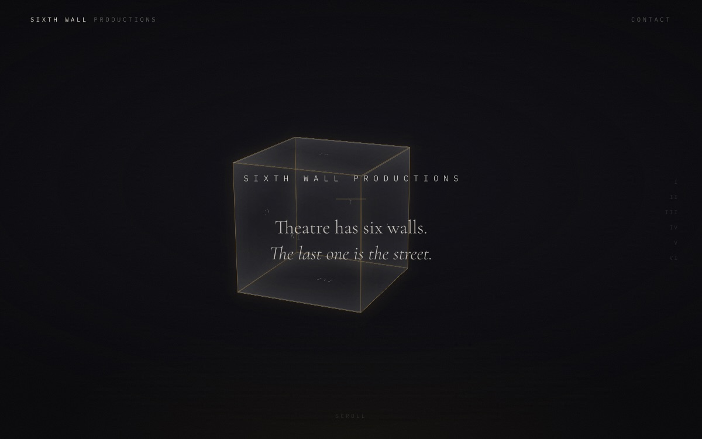
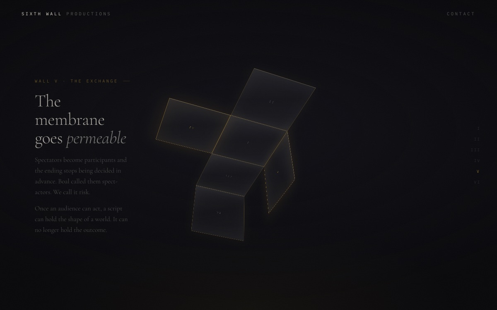
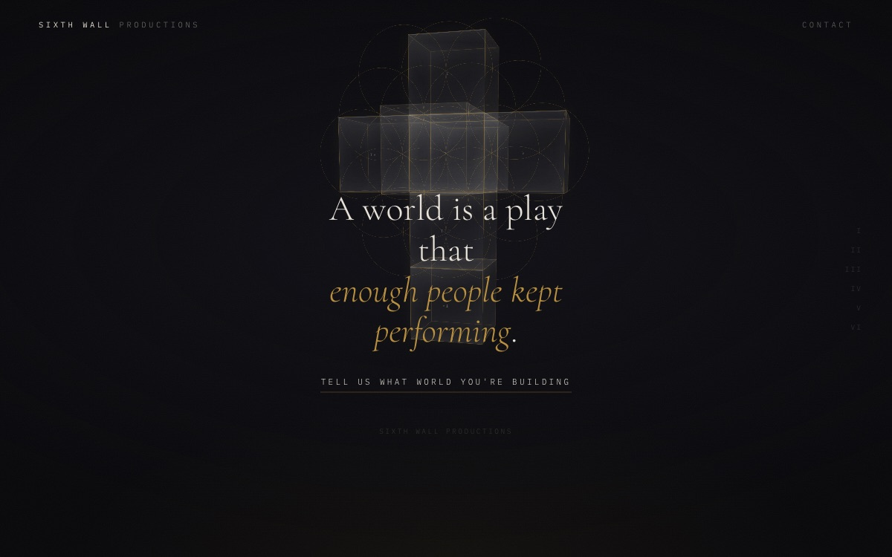

# Sixth Wall Productions

The public site for Sixth Wall Productions — ritual theatre, immersive worlds, and story partnership.

**Live:** <https://sixthwall.productions>

A single-page scroll narrative: a cube net unfolds through six walls as the copy
advances, then every face of the open cross gains depth — the six squares become
eight cubes, the unfolded hypercube of Dalí's *Corpus Hypercubus*, standing
upright against a flower-of-life lattice.

| Opening | Mid-unfold | Finale |
| --- | --- | --- |
|  |  |  |

---

## Quick start

```bash
npm install
npm run dev        # http://localhost:4321
```

| Command | Does |
| --- | --- |
| `npm run dev` | Dev server with hot reload |
| `npm run build` | Static build into `dist/` |
| `npm run preview` | Serve the built output locally |
| `npm run check` | Typecheck `.astro` and `.ts` (runs in CI) |

Requires Node 22+ (see `.nvmrc`).

---

## How the site works

The whole page is driven by **one number**: scroll progress `p`, from 0 to 1.
Every animated property is a pure function of `p`, so the page holds no
animation state between frames and is fully scrubbable.

```
scroll position ──► p (0…1) ──► render(p)
                                  ├─ cube flaps unfold
                                  ├─ camera tilts / scales
                                  ├─ faces light
                                  ├─ copy panels cross-fade
                                  ├─ faces extrude into the hypercube cross
                                  └─ lattice resolves
```

### Where to change things

| To change… | Edit |
| --- | --- |
| **Copy** of any panel | `src/content/panels/*.md` |
| **When** a panel appears | `scrollIn` / `scrollOut` in that panel's frontmatter |
| **Order** of panels | `order` in frontmatter |
| **Animation timing / feel** | `src/config/choreography.ts` |
| **Overall pace** (faster / slower scroll) | `choreography.scrollLength` |
| **Name, domain, contact email, tagline** | `src/config/site.ts` |
| **Colour, type, cube size** | `src/styles/tokens.css` |
| **The render loop itself** | `src/scripts/scene.ts` |

### The timing contract

A wall panel's frontmatter is the *only* place its timing is written:

```yaml
face: 3              # lights cube face 3 and rail tick IV
scrollIn: 0.340
scrollOut: 0.435
```

Astro renders those onto the panel as `data-in` / `data-out` / `data-face`, and
`scene.ts` reads them back off the DOM. So the copy, the cube face and the
chapter rail all move together from one edit — they cannot drift apart.

`src/lib/panels.ts` fails the build if two panels claim the same `order` or the
same cube `face`, or if the scroll order contradicts the sort order.

### Headings

Braces italicise a phrase, in panel headings and in `site.ts` copy alike:

```yaml
heading: Something wants to {be made}
```

→ Something wants to *be made*

Headings are escaped before the `<i>` is added, so frontmatter can never inject
markup (`src/lib/emphasis.ts`).

---

## Project layout

```
src/
  config/
    site.ts            identity, domains, contact, non-panel copy
    choreography.ts    every animation constant, named and typed
  content/
    panels/*.md        the ten scroll panels — copy + timing
  content.config.ts    collection schema (validated at build)
  components/          Masthead, Rail, CubeNet, Hero, Panels, Closing
  layouts/Base.astro   document shell, meta, Open Graph, JSON-LD
  lib/                 emphasis helper, panel loading + invariants
  scripts/             scene.ts (render loop), easing.ts
  styles/              tokens, base, chrome, scene, copy
public/                CNAME, favicon, og.jpg, robots.txt
docs/
  original-mockup.html the hand-built single-file original, for reference
```

### Why the CSS is global

`scene.ts` creates the mini cubes and lattice circles at runtime. Astro's
scoped styles work by stamping an attribute onto elements at *build* time, so
scoped rules would silently never match those nodes. The stylesheets are
therefore plain global CSS, imported once in `Base.astro`.

---

## Deployment

Pushing to `main` triggers `.github/workflows/deploy.yml`, which typechecks,
builds, and publishes `dist/` to GitHub Pages. No manual step.

**Domains** (registrar: Namecheap, DNS: Namecheap BasicDNS)

| Domain | Role |
| --- | --- |
| `sixthwall.productions` | Canonical. Apex + `www` → GitHub Pages. |
| `sixthwallproductions.com` | Redirects to the canonical domain. |

The canonical hostname is written in three places that must agree:
`public/CNAME`, `site.url` in `src/config/site.ts`, and the GitHub Pages custom
domain setting. Change one, change all three.

See [`docs/INFRASTRUCTURE.md`](docs/INFRASTRUCTURE.md) for the full DNS records
and how to change domains.

---

## Roadmap

Deliberately deferred, in rough order of when they will matter:

- **Contact email** — `hello@sixthwall.productions` needs email forwarding
  enabled in the Namecheap dashboard. See `docs/INFRASTRUCTURE.md`.
- **Self-hosted fonts** — currently loaded from Google Fonts, which is a
  render-blocking third-party request and a privacy consideration.
- **Sincerely Ironic** — the apparel arm (Sixth Wall Productions DBA) lives at
  `sincerelyironic.com`. `site.ventures.apparel.live` flips the link on.
- **Second page** — the layout, collection and nav patterns are already in
  place; add `src/pages/<name>.astro`.
